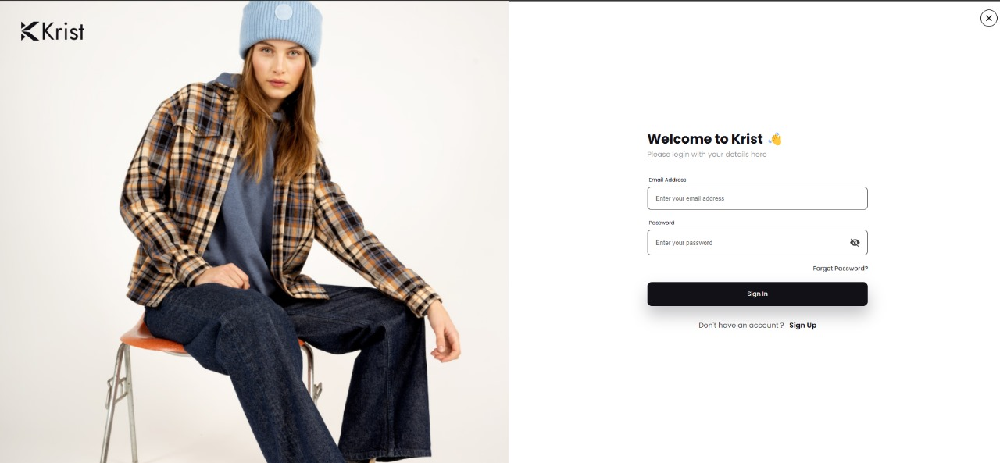
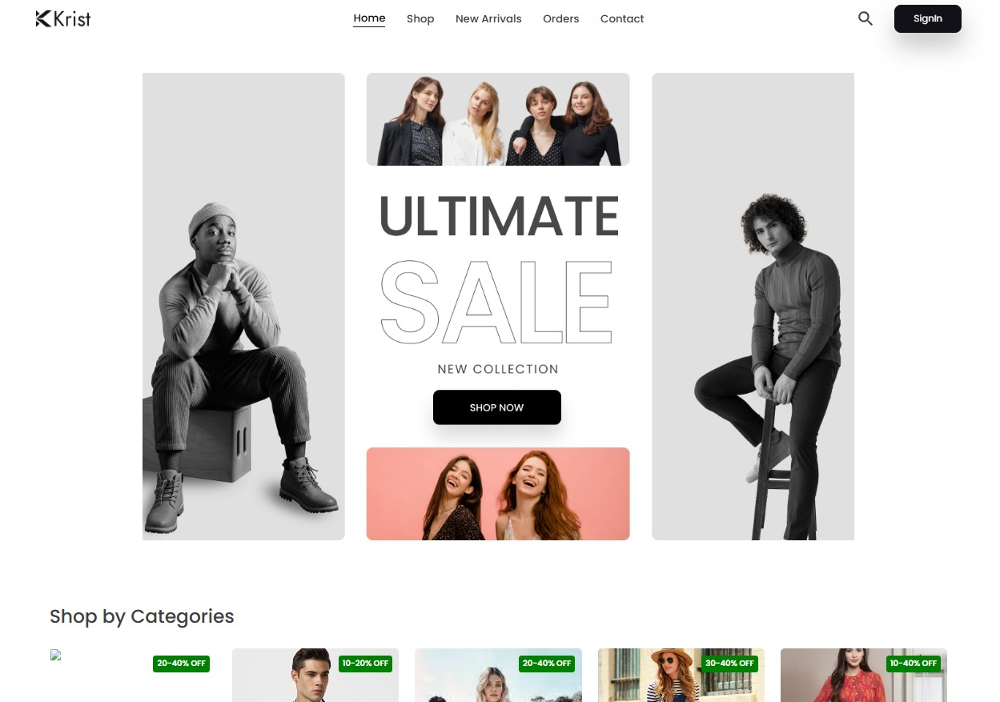

# 🛒 E-Commerce Website


### 📌 Home Page:


---

### 📌 Product Page:



A fully functional **E-commerce website** built using the **MERN stack** (MongoDB, Express.js, React.js, and Node.js). This app supports **authentication**, product search, category filters, and an optimized user experience.

---

## 🚀 Features

### Core Functionalities:
- **User Authentication**: 
   - Register, Login, and Logout with secure password hashing using `bcrypt`.
   - JWT-based authentication to protect private routes.
- **Product Management**:
   - Browse products by categories.
   - Search products using keywords.
   - Apply price and category filters.
- **Cart System**:
   - Add and remove products from the shopping cart.
   - Cart persists across sessions.
- **Order Management**:
   - Place orders and view order details.
- **Admin Panel**:
   - Manage (add/update/delete) products.
   - View and process user orders.
- **Payment Integration**: (Optional placeholder for Stripe/PayPal Integration)
   - Users can proceed with payments securely.

### Other Features:
- **Fully Responsive**: Works seamlessly on all screen sizes.
- **Search & Filters**: Search by product name and filter results by category and price range.
- **Modern UI/UX**: Designed with React.js components and TailwindCSS/Bootstrap for a clean look.

---

## 🛠️ Tech Stack

### Frontend:
- **React.js**: Component-based UI development.
- **React Router**: For page navigation.
- **Axios**: HTTP requests to communicate with the backend.
- **Redux** *(optional)*: State management for cart and user.

### Backend:
- **Node.js**: JavaScript runtime for the server.
- **Express.js**: Lightweight web framework for building the REST API.
- **MongoDB**: NoSQL database to store products, users, and orders.
- **Mongoose**: ODM for MongoDB.
- **JWT**: Secure token-based user authentication.
- **Bcrypt**: Password encryption.

---

## Getting Started

### Prerequisites
Ensure you have the following installed on your system:
- Node.js (v14 or higher)
- npm or yarn

### Installation

1. Clone the repository:
   ```bash
   [git clone https://github.com/your-username/admin-dashboard.git](https://github.com/poojaDEvrari/admin-dashboard)
   cd admin-dashboard
   ```
2.Install dependencies:
```bash
npm install
```

3. Start the development sever
```bash
npm start
```


